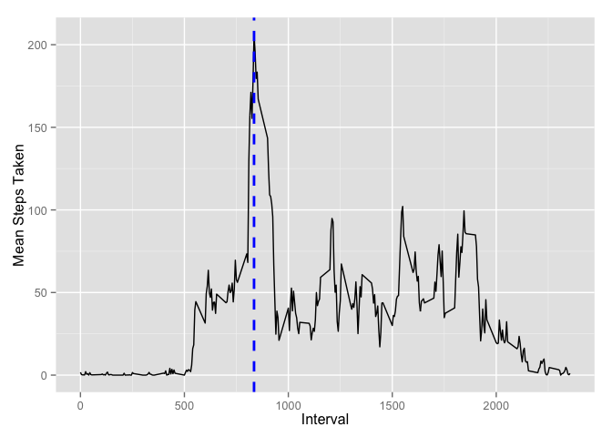
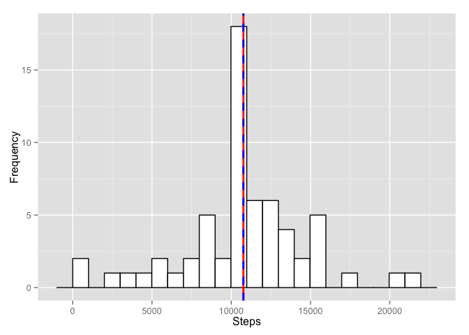
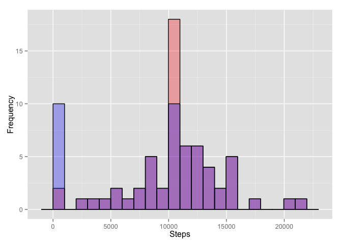

# Reproducible Research: Peer Assessment 1


## Loading and preprocessing the data
We assign the data in activity.csv to a variable, and prepare the correct classes for processing.

```r
activity<-read.csv("activity.csv")
activity$date<-as.POSIXct(activity$date, tz="", format="%Y-%m-%d")
```

## What is mean total number of steps taken per day?
We use the aggregate function to sum the number of steps taken per day using the additional na 
options to keep data from days with NA measurements and to not let NA values interfere with our
mean calculations.

```r
sumsteps<-aggregate(steps ~ date, activity, sum, na.action=na.pass, na.rm=TRUE)
```

The mean steps taken per day is:

```r
mean(sumsteps$steps)
```

```
## [1] 9354
```
The median steps taken per day is:

```r
median(sumsteps$steps)
```

```
## [1] 10395
```
To build our histogram, we use ggplot and add a red dashed line for our mean and a blue dashed line for our median.


```r
library(ggplot2)
ggplot(sumsteps, aes(steps))+geom_histogram(binwidth=998, color="black", fill="white")+geom_vline(aes(xintercept=mean(steps, na.rm=TRUE)), color="red", linetype="dashed", size=1)+geom_vline(aes(xintercept=median(steps, na.rm=TRUE)), color="blue", linetype="dashed", size=1)+xlab("Steps")+ylab("Frequency")
```

 

## What is the average daily activity pattern?
We aggregate the mean steps per interval from our 61 days of observations to get a plot of average activity over the course of this period of time. The blue dashed line denotes the max of the interval. Which.max is helpful here to place the max line in the graph, find the max steps, and the interval this occurs in with tidy code.

```r
meanint<-aggregate(steps ~ interval, activity, mean, na.action=na.pass, na.rm=TRUE)
ggplot(meanint, aes(interval,steps))+geom_line()+xlab("Interval")+ylab("Mean Steps Taken")+geom_vline(aes(xintercept=meanint[which.max(meanint$steps),1]), color="blue", linetype="dashed", size=1)
```

 

The maximum number of steps taken would be:

```r
meanint[which.max(meanint$steps),2]
```

```
## [1] 206.2
```
The interval where we observe this max is:

```r
meanint[which.max(meanint$steps),1]
```

```
## [1] 835
```

## Imputing missing values
The number of observations with NA values is:

```r
sum(!complete.cases(activity))
```

```
## [1] 2304
```
We will take the mean activity level for the missing intervals and use those to replace the NA values. To achieve this, we need to set up a for loop to replace NA observations on specific intervals with the mean value for that specific interval .

```r
actimp<-activity
for(i in 1:nrow(actimp)){
  if (is.na(actimp$steps[i])){
    actimp$steps[i]<-meanint$steps[which(actimp$interval[i] == meanint$interval)]
  }
}
```
Now we aggregate these steps into a new sum per day.

```r
sumimp<-aggregate(steps ~ date, actimp, sum, na.action=na.pass, na.rm=TRUE)
```
Our mean with imputed values is:

```r
mean(sumimp$steps)
```

```
## [1] 10766
```
Our median with imputed values is:

```r
median(sumimp$steps)
```

```
## [1] 10766
```
This data generates a histogram of:

```r
ggplot(sumimp, aes(steps))+geom_histogram(binwidth=998, color="black", fill="white")+geom_vline(aes(xintercept=mean(steps, na.rm=TRUE)), color="red", linetype="solid", size=1)+geom_vline(aes(xintercept=median(steps, na.rm=TRUE)), color="blue", linetype="dashed", size=1)+xlab("Steps")+ylab("Frequency")
```

 

The new histogram with imputted data shows a much smaller frequency for 0-998 step days. The median and mean now occupy the same value, and the most value range for number of steps taken has increased in frequency for our 61 day period. 

The next chart shows the old frequency in blue, the new frequency in red, and the purple denotes where they overlap.

```r
ggplot(sumimp, aes(steps))+geom_histogram(binwidth=998, color="black", fill="red", alpha=".3")+geom_histogram(data=sumsteps, binwidth=998, color="black", fill="blue", alpha="0.3")+xlab("Steps")+ylab("Frequency")
```

 

## Are there differences in activity patterns between weekdays and weekends?
