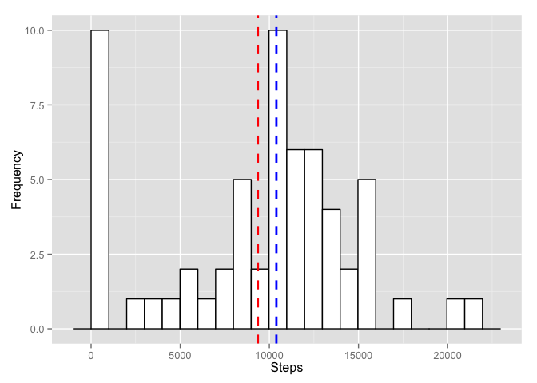

# Reproducible Research: Peer Assessment 1


## Loading and preprocessing the data
We assign the data in activity.csv to a variable, and prepare the correct classes for processing.

```r
activity<-read.csv("activity.csv")
activity$date<-as.POSIXct(activity$date, tz="", format="%Y-%m-%d")
activity$interval<-as.difftime(activity$interval, units = "mins")
```

## What is mean total number of steps taken per day?
We use the aggregate function to sum the number of steps taken per day using the additional na 
options to keep data from days with NA measurements and to not let NA values interfere with our
mean calculations.

```r
sumsteps<-aggregate(steps ~ date, activity, sum, na.action=na.pass, na.rm=TRUE)
```

The mean steps taken per day is:

```r
mean(sumsteps$steps)
```

```
## [1] 9354
```
The median steps taken per day is:

```r
median(sumsteps$steps)
```

```
## [1] 10395
```
To build our histogram, we use ggplot and add a red dashed line for our mean and a blue dashed line for our median.


```r
library(ggplot2)
ggplot(sumsteps, aes(x=steps)) + geom_histogram(binwidth=1000, color="black", fill="white")+geom_vline(aes(xintercept=mean(steps, na.rm=TRUE)), color="red", linetype="dashed", size=1)+geom_vline(aes(xintercept=median(steps, na.rm=TRUE)), color="blue", linetype="dashed", size=1)
```

 

## What is the average daily activity pattern?


## Imputing missing values


## Are there differences in activity patterns between weekdays and weekends?
